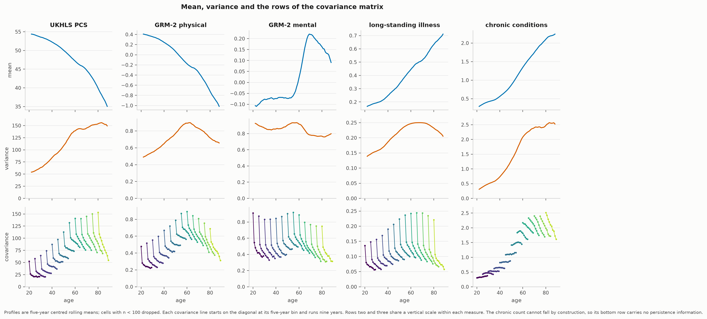
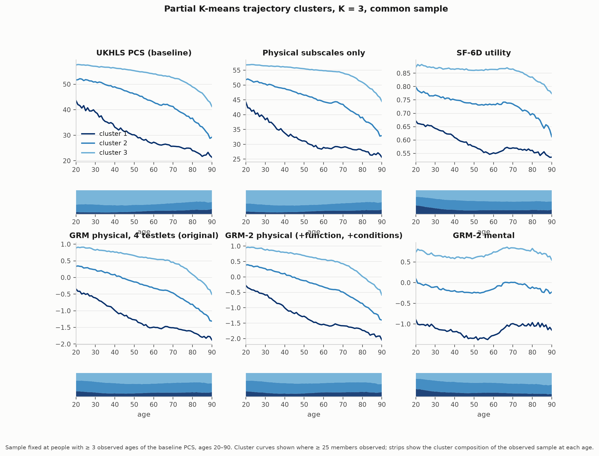
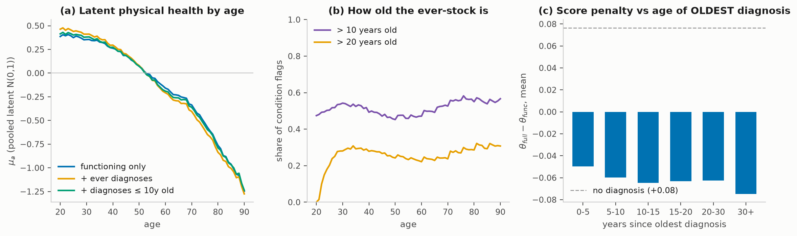

# Health measures for the prevention project

*Julian Ashwin — August 2026. Built and validated by `data_cleaning/03–06` and
`descriptives/01–04`; every number in this note is printed by those scripts'
self-validation output.*

This note records which UKHLS health variables the project uses, how each
measure is constructed, why the setup is the way it is, and how the new
two-dimensional GRM behaves against everything that came before it (the
original physical GRM, PCS/MCS, the physical-only composite, SF-6D, GHQ).

## 1. The variable inventory

We restrict the measurement models to items asked in **(nearly) every wave**,
so that a person's score means the same thing wherever it lands in the panel.
Wave-by-wave presence was verified against the raw headers of all 15 indresp
files; labels against the UKDA-6614 data dictionaries.

| Variables | Waves | Used |
|---|---|---|
| SF-12, all 12 items (`sf1..sf7`, self-completion versions preferred) | all 15 | both GRMs, PCS/MCS reconstruction, SF-6D |
| GHQ-12 items (`scghqa..l`, 4 categories) | all 15 | mental GRM |
| Equality Act impairment list (`disdif1..12`), gated on long-standing illness (`health`) | all 15 | physical GRM (FUNC testlet) |
| Long-standing illness (`health`) | all 15 | gate for `disdif`; descriptive |
| Diagnosed conditions (`hcond*` families, wave-1 code list 1–17) | all 15 (see §2) | condition-group items; sensitivity variants |
| Health satisfaction (`sclfsat1`) | all 15 | validation outcome only (global evaluation; would cross-load) |
| SWEMWBS (`scwemwb*`) | 1, 4, 7, 10, 13 | excluded: fails the every-wave rule |
| ADL/IADL module (`adla..n`) | 7, 9, 11, 13 | excluded here; remains the mixed model's sparse channel |
| Loneliness (`sclonely`) | 9–15 | excluded: late-panel only |
| GP visits, hospital admissions (`hl2gp`, `hosp`) | 7–15 | reserved as criterion-validity outcomes |
| Self-reported height/weight | wave 1 only | excluded (measured biomarkers live in UKDA-7251, not held) |

## 2. Chronic conditions

### 2.1 Construction

UKHLS asks the full "ever diagnosed" inventory (`hcond1..17`) at a person's
**first** interview; each later wave records conditions newly reported since
the last interview under a name that changes with questionnaire redesigns —
`hcondn{i}` (waves 2–9), `hcondcode{i}` (10–12), `hcondncode{i}` (13–15), all
verified against the UKDA dictionaries. The running indicator

> ever had condition *i* by wave *w* ⇔ reported in any of these families at
> any wave ≤ *w*

is monotone by construction and defined from the person's first inventory
onward (76% of person-waves). Only the wave-1 code list is used, so the
definition is identical in every wave. Per-condition indicators, diagnosis
ages and group counts are on disk
(`data/processed/measures/chronic_conditions.parquet`); nothing is collapsed
before the modelling layer.

This corrects two defects in the earlier EIT count (`build_chronic_count.R`),
which used `hcondns*` ("still has **newly diagnosed** condition") as its
new-report family: that family has **no codes 6 and 7 at all** — every
in-panel heart attack and stroke was missed — and it drops new diagnoses
reported as already resolved. Our count is a strict near-superset: against
the EIT file we agree exactly on 94.2% of 458k person-waves and are **≥ the
EIT count on 100.000% of rows** (26,516 documented additions, concentrated in
MI, stroke and cancer).

### 2.2 Why "ever", not "current"

The "still has condition" family (`hconds##`) looks like a current-status
variable but is **asked only at the wave a condition is reported**: at wave 6,
of 5,090 respondents with asthma ever reported, only ~570 were routed to it.
A per-wave "current" variable would therefore be ~90% carry-forward
imputation. Beyond measurability, self-reported remission conflates control
with cure — respondents report managed hypertension and diabetes as "no
longer having" them, the same mechanism behind the under-reporting found when
self-reports are compared with measured disease (Johnston, Propper & Shields
2009, *J Health Econ*) and with GP records, where agreement is good for
diabetes but poor for heart disease and arthritis (Kriegsman et al. 1996,
*J Clin Epidemiol*). The monotone ever-indicator matches the
deficit-accumulation tradition (Mitnitski, Mogilner & Rockwood 2001; Searle
et al. 2008). Its genuine cost — old diagnoses shadowing current health — is
quantified, not assumed away, in §5.

### 2.3 Why grouped, not 17 indicators

Grouping is the note's testlet logic applied to diagnoses. CHD, angina, MI,
CHF and stroke are one disease process reported several ways; as separate
items they would violate local independence exactly as the `sf2a`/`sf2b` pair
did before the original GRM collapsed them (Wainer & Kiely 1987; Yen 1993).
Rare conditions (CHF, stroke, epilepsy at 1–2% prevalence) also make weak,
unstable IRT items — minimum prevalence is an explicit deficit-inclusion
criterion in Searle et al. (2008) — and the groups keep a stable clinical
meaning while the raw code list grows over waves (cf. the multimorbidity
clusters of Barnett et al. 2012, *Lancet*). An ordinal within-group count
(0/1/2+) keeps a severity gradient the way PF = `sf2a`+`sf2b` does. The
groups: **CVD** {CHF, CHD, angina, MI, stroke}, **METAB** {diabetes,
hypertension}, **RESP** {asthma, bronchitis, emphysema}, **MSK** {arthritis},
**CANCER**, **OTHER** {thyroid ×2, liver, epilepsy}; **DEPR** {clinical
depression} sits on the mental side.

Ever-prevalence at the person-wave level: hypertension 21.4%, arthritis
16.2%, depression 8.2%, diabetes 7.2%, cancer 5.1%, any CVD event 7.4%.

### 2.4 Diagnosis timing

Every inventory report carries `hconda##` (age told); every in-panel new
report is dated by its interview wave. Result: **100.0% of ever-flags carry a
usable diagnosis age**, so recency-restricted variants are exact, not
imputed. The stock is old: across dated condition-person-waves the median
diagnosis is 11 years old (p25 = 5, p75 = 21); at ages 65–80, 54% of flags
are more than 10 years old and 26% more than 20.

## 3. Two GRMs: physical and mental

### 3.1 Why two separate unidimensional models

The measurement model must remain a static map from responses to a score
(dynamics are estimated afterwards), and PROMIS practice is to build
**separate unidimensional banks per domain** rather than one multidimensional
model (Cella et al. 2010, *J Clin Epidemiol*). Two clean banks also make the
physical–mental correlation an *estimate* rather than an artifact: the SF-12's
orthogonal scoring forces r(PCS, MCS) = 0, our corrected promax gives 0.59,
published correlated-scoring estimates are 0.62 (Farivar, Cunningham & Hays
2007) and 0.71–0.73 (Tucker et al.); the two GRM thetas below correlate
**0.457**.

Cross-loading SF-12 items are assigned by **this repo's own UK wave-1 varimax
loadings** (phys/ment): PF .86/.14, RP .85/.25, BP .75/.17, GH .72/.27 →
physical; MH .09/.89, RE .26/.82, SF .48/.64 → mental. **VT (energy) loads
.55/.44 and enters neither bank** — genuinely bidimensional (PROMIS likewise
treats fatigue as its own domain). Cognitive and sensory `disdif` items
(memory, hearing, sight, communication, danger) are separate constructs in
WHODAS 2.0 terms and are excluded from both.

### 3.2 The item banks

Everything is coded so category 1 is worst health. Physical comes in three
specifications sharing the four validated testlets of the original GRM:

| Spec | Items |
|---|---|
| **P-FUNC** | GH, PF, RP, BP + **FUNC** (count of physical `disdif` limitations {mobility, lifting, dexterity, coordination, personal care}, 0/1/2/3+; `health` = "no" is a valid structural zero because the module is skipped by design) |
| **P-FULL** | P-FUNC + six ever-diagnosis group items (CVD/METAB/RESP 0/1/2+; MSK/CANCER/OTHER binary) |
| **P-REC** | as P-FULL, counting only diagnoses made within the last 10 years |

Mental: MH ((6−`sf6a`)+`sf6c`−1, 9 levels), RE (`sf4a`+`sf4b`−1, 9), SF
(`sf7`, 5), the 12 GHQ items (4 levels each), and ever-depression. GHQ-12 is
validated internationally (Goldberg et al. 1997, *Psychol Med*) but its
factor-analytic "dimensions" largely reflect negative-wording method effects
(Hankins 2008, contra Graetz 1991), so the pre-specified rule was: fit
item-level, and if Yen's Q3 shows positive within-wording dependence, collapse
to two wording testlets — the same cure the original GRM applied to the PF/RP
pairs. **The rule triggered** (within-wording Q3 mean +0.024, max +0.261):
the final mental bank is MH, RE, SF, GHQ-positive (19 levels), GHQ-negative
(19), DEPR.

### 3.3 Estimation and diagnostics

Same machinery as the replicated original: Samejima's graded response model
(Samejima 1969), marginal ML by EM over response patterns, 121-point
quadrature, pooled latent N(0,1); multigroup by single year of age (20–90)
for the μₐ, σₐ profiles. Samples: P-FUNC 497,423 person-years; P-FULL/P-REC
387,599 (condition items exist only from first inventory); mental 379,462.

| Diagnostic | P-FUNC | P-FULL | P-REC | MENT |
|---|---|---|---|---|
| max positive Q3 | −0.048 | +0.144 | +0.080 | +0.153 |
| EAP identity (var + E[psd²] = 1) | 1.000 | 1.000 | 1.000 | 1.000 |
| r with original GRM θ | 0.994 | 0.985 | — | — |

Discriminations (pooled fits): the functioning items dominate — FUNC a = 3.3
(P-FUNC spec: GH 2.0, PF 3.7, RP 3.4, BP 2.4). The condition-group items are
**weak by comparison** (CVD 1.15, MSK 0.85, RESP 0.68, METAB 0.59, CANCER
0.58, OTHER 0.62): once functioning is measured well, an old diagnosis adds
little information about current physical health. On the mental side the
strongest single indicators are the GHQ negative-wording testlet (a = 3.15)
and MH (2.75); the ever-depression diagnosis is, again, weak (0.97).

## 4. How the new measures relate to the old ones

Correlations over all person-waves (`descriptives/01`):

| | θ phys (FULL) | θ ment |
|---|---|---|
| original GRM (4 testlets) | **0.985** | 0.48 |
| UKHLS PCS | 0.904 | 0.23 |
| physical-only composite | 0.946 | 0.48 |
| UKHLS MCS | 0.27 | **0.882** |
| GHQ-12 Likert | −0.38 | **−0.904** |
| SF-6D utility | 0.71 | **0.799** |
| chronic count | −0.58 | −0.21 |
| θ phys × θ ment | **0.457** | |

Three reads. The physical GRM is the same object the project already
validated, now with functioning attached (r = 0.985 with the original; the
FUNC testlet is what moves the remaining mass). The mental GRM is
recognisably the MCS/GHQ construct without the SF-12's orthogonality
artifact. And SF-6D correlates *more* with the mental theta (0.80) than the
physical one (0.71) — the note's earlier warning about treating SF-6D as a
physical measure, restated in one line.

The mean/variance/covariance anatomy (the empirics note's Figure 3, rebuilt
here as `descriptives/03`): the physical GRM reproduces the familiar
accelerating mean decline with rising-then-plateauing dispersion and
covariance rows that fan with age; the mental GRM shows the textbook
late-life wellbeing improvement (rising to ~75, falling after); long-standing
illness and the chronic count give the same anatomy from items disjoint from
the SF-12 — and the chronic count's bottom row carries no persistence
information because it cannot fall.

Partial K-means trajectory clusters (the construction note's Figure 5,
rebuilt as `descriptives/02`; K = 3, 50 seeded inits, sample fixed at people
with ≥ 3 observed baseline-PCS ages, ages 20–90): changing the *scoring*
moves the typology modestly while changing the *construct* redraws it. The
physical-only composite agrees with the baseline at ARI 0.67 (88% of people
in the same cluster); the IRT re-spacings sit at ARI 0.43 (original GRM) and
0.41 (GRM-2 physical, on its inventory-covered 38,943 people), SF-6D at 0.19
— and the **mental GRM partitions people near-independently of the physical
baseline (ARI 0.07; 49% same-cluster against a 47% chance rate)**. The
physical typology is robust to how physical health is scored; the mental
dimension is genuinely new information, not a re-shuffling of the physical
clusters.

## 5. The ever-variable question, quantified

The misgiving: historical diagnoses accumulate mechanically with age, so a
diagnosis-bearing measure could manufacture "decline" out of stale
paperwork. Three reads, all in `descriptives/04` and the figure below:

1. **Latent age profiles.** μ(80) − μ(30) is −1.117 SD functioning-only,
   −1.247 with ever-diagnoses, −1.170 with only diagnoses ≤ 10 years old.
   Ever-diagnoses steepen the measured lifecycle decline by 0.130 SD (12%),
   and **59% of that extra steepness comes from diagnoses more than a decade
   old** — the mechanistic stock — leaving stale accumulation at ~6% of the
   total P-FULL decline.
2. **Staleness.** At every age past 40, roughly half the ever-stock is > 10
   years old (§2.4), so the *potential* for carryover is large; the small
   realised effect reflects the condition items' low discriminations.
3. **The person-level signature.** The score penalty θ_FULL − θ_FUNC is
   essentially **flat in the age of the oldest diagnosis** (−0.05 SD at 0–5
   years to −0.075 at 30+, against +0.08 for the never-diagnosed): the
   ever-items charge a 30-year-old diagnosis nearly the same as last year's.
   The items cannot tell stale from fresh — they are simply too weak for the
   difference to matter much.

The age-invariance test (item parameters freed across bands 20–44 / 45–64 /
65–90, latent distributions free throughout) rejects overwhelmingly, as any
test does at n = 388k (2ΔlogL = 111,663 on 82 df), but the pattern is the
informative part: the condition items' discriminations **fall with age**
(CVD 1.10 → 0.84, CANCER 0.52 → 0.24, OTHER 0.70 → 0.41 across the three
bands) — at older ages an ever-diagnosis says progressively less about
current health, which is the accumulation mechanism showing up exactly where
the model can express it.

**Recommendation.** For lifecycle *dynamics* use **P-FUNC** (or equivalently
the original 4-testlet GRM, r = 0.994) as the physical measure: it is a pure
current-state instrument, asked identically in every wave. Treat **P-FULL**
as a descriptive companion and **P-REC** as its recency check — the
diagnosis-bearing profiles bound the accumulation bias at ~0.08–0.13 SD over
the working-to-old-age span. Where conditions matter substantively (they do:
onset, multimorbidity, mortality), model them as **separate channels in the
Bayesian mixture**, where their own dynamics are estimated rather than frozen
into a static score — and where "ever" is the correct state variable, not a
compromise.

## 6. Reproducibility

| Step | Script | Self-validation |
|---|---|---|
| Chronic layer | `data_cleaning/05_build_chronic.py` | 100% timing coverage; ≥ EIT count on 100.000% of rows |
| GRMs | `data_cleaning/06_build_grm2.py` | 11 gates: Q3, EAP identity, old-GRM tracking, sample coverage |
| Panel + correlations | `descriptives/01_measure_landscape.py` | writes `artifacts/descriptives/` CSVs |
| Figures | `descriptives/02–04` | this note's three figures |

The original GRM's exact replication (θ to 1e-5 on all 498,424 person-waves
against the R fit) is `data_cleaning/04_build_grm.py`; the SF-12/SF-6D layer
and its note-for-note validation is `03_build_measures.py`. Everything under
`data/` derives from licensed UKHLS microdata and is never committed; the
figures here are aggregate statistics only.

### References

Barnett et al. (2012) *Lancet* 380:37–43 · Cella et al. (2010) *J Clin
Epidemiol* 63:1179–94 · Farivar, Cunningham & Hays (2007) *Health Qual Life
Outcomes* 5:54 · Goldberg et al. (1997) *Psychol Med* 27:191–7 · Graetz
(1991) *Soc Psychiatry Psychiatr Epidemiol* 26:132–8 · Hankins (2008) *Clin
Pract Epidemiol Ment Health* 4:10 · Johnston, Propper & Shields (2009)
*J Health Econ* 28:540–52 · Kriegsman et al. (1996) *J Clin Epidemiol*
49:1407–17 · Mitnitski, Mogilner & Rockwood (2001) *ScientificWorldJournal*
1:323–36 · Samejima (1969) *Psychometrika Monogr* 17 · Searle et al. (2008)
*BMC Geriatr* 8:24 · Wainer & Kiely (1987) *J Educ Meas* 24:185–201 · Ware,
Kosinski & Keller (1996) *Med Care* 34:220–33 · Yen (1993) *J Educ Meas*
30:187–213.
